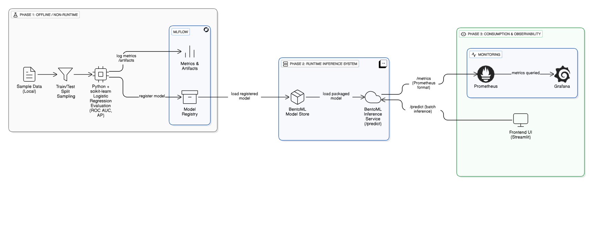

# Credit Card Fraud Detection — End-to-End MLOps (Local)

## Tech stack

This project is built using the following technologies:

* **Python 3.10**
  Used for data preparation, model training, evaluation, and serving.

* **scikit-learn**
  Used to train a binary classification model for fraud detection.

* **pandas & NumPy**
  Used for data manipulation, preprocessing, and feature handling.

* **MLflow**
  Used to track experiments, parameters, metrics, and model artifacts during training.

* **BentoML**
  Used to package the trained model and serve it as a production-style HTTP inference service.

* **Streamlit**
  Used as a lightweight UI to upload CSV files and run batch predictions locally.

* **Prometheus**
  Used to scrape and store inference-level metrics from the BentoML service.

* **Grafana**
  Used to visualise request rates, latency, and service behaviour over time.

---

## Why I built this

I didn’t want to build another fraud detection notebook that trains a model once and stops there.

Fraud detection is interesting not because the classification problem is novel, but because **how the model is trained, deployed, observed, and interacted with** matters just as much as accuracy.

This project focuses on the **operational reality of machine learning**, not just the modelling step. In real systems, models:

* receive data in batches and streams
* need to be served behind APIs
* must be observable when things go wrong
* must handle scale and payload limits
* are evaluated continuously, not once

The goal here was to build something that behaves like a real ML service, even when running locally.

---

## What this project is doing

At a high level, this project builds a **binary fraud detection system** that can score large batches of credit card transactions through an API.

The flow looks like this:

1. A historical credit card dataset is prepared and split into train and test sets
2. A binary classifier is trained and evaluated
3. Experiments and metrics are tracked using MLflow
4. The trained model is registered and served using BentoML
5. A user uploads a CSV file through a UI
6. The data is sent to the BentoML service for inference
7. Fraud probabilities are returned and displayed
8. Inference traffic and latency are monitored via Prometheus and Grafana

The emphasis is not just on prediction, but on **end-to-end behaviour**.

---

## Why batch inference and not single requests

Fraud detection systems often need to score **large volumes of transactions**:

* historical backfills
* delayed processing
* investigations
* audits

Serving only single-row predictions hides real-world constraints such as payload size, memory usage, and request latency under load.

This project intentionally supports batch inference to surface those constraints early, rather than pretending they don’t exist.

---

## Data and realism

The dataset used is a real, anonymised credit card transaction dataset with PCA-transformed features.

While the feature names are abstract, the structure reflects real fraud detection challenges:

* extreme class imbalance
* subtle signal separation
* high false-positive cost
* probabilistic decision-making

The model outputs **fraud probabilities**, not hard decisions. This mirrors how real systems operate, where thresholds are applied downstream based on risk tolerance rather than fixed labels.

---

## Why BentoML

BentoML was chosen to make the model behave like a **production service**, not a script.

Using BentoML forces you to think about:

* request schemas
* response formats
* payload sizes
* concurrency
* observability
* API stability

The service exposes both:

* a `/predict` endpoint for inference
* a `/metrics` endpoint for monitoring

This makes it possible to treat the model like a real system component rather than a one-off artifact.

---

## Observability with Prometheus and Grafana

A key goal of this project was to make the model **observable**, not just functional.

Prometheus scrapes metrics directly from the BentoML service, including:

* request counts
* request latency
* in-flight requests
* runner execution timing

Grafana is used to visualise these metrics over time, answering questions such as:

* Is traffic reaching the model?
* How long do predictions take?
* Are requests failing or backing up?
* How does batch size affect latency?

This layer turns the model into something you can reason about operationally.

---

## What this project deliberately does not do (yet)

Several things are intentionally out of scope for this iteration:

* no automated retraining
* no feature store
* no data drift detection
* no alerting rules
* no cloud deployment
* no authentication or access control

These are not ignored — they are deferred to keep the system understandable and traceable.

---

## Known limitations

The following limitations are documented and intentional:

* inference is synchronous
* batch size is constrained by memory and transport limits
* model is trained once per run
* thresholds are not tuned for business objectives
* monitoring focuses on service health, not model quality drift

Each of these would be addressed incrementally in later iterations.

---

## Possible next iterations

Future extensions of this project could include:

* asynchronous inference
* chunked batch processing
* model version comparison in production
* data drift monitoring
* alerting on latency or error rate
* scheduled retraining
* cloud deployment (AWS or Azure)

The current version provides a stable foundation for those steps.

---

## Final note

This project is intentionally **end-to-end and local**, but it mirrors real production concerns closely.

The value is not in the model alone, but in seeing how data, models, APIs, and monitoring interact as a system.

That is the level at which machine learning actually becomes useful.
